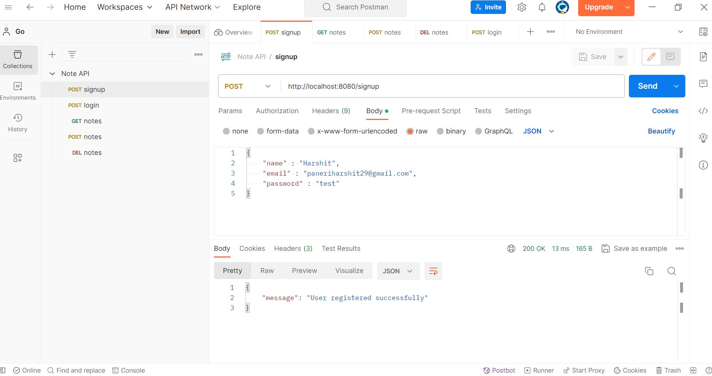
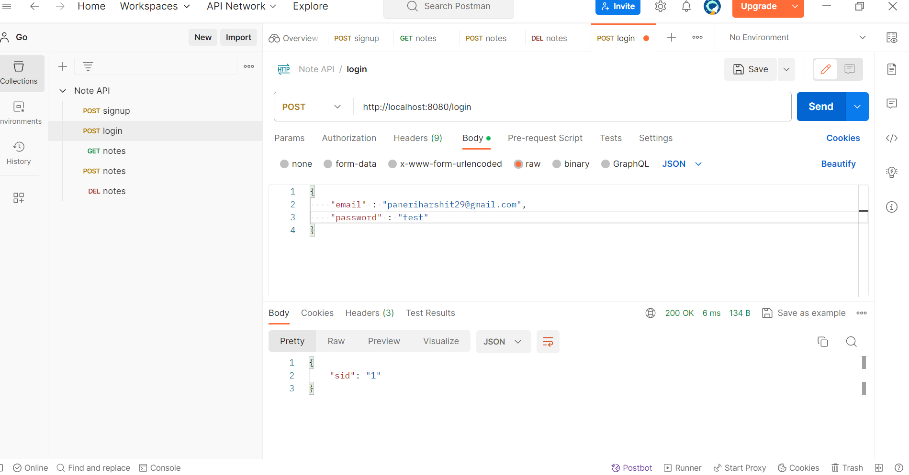
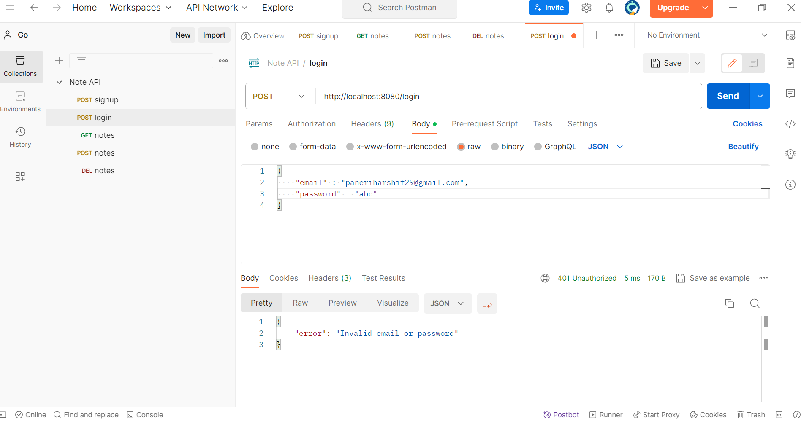
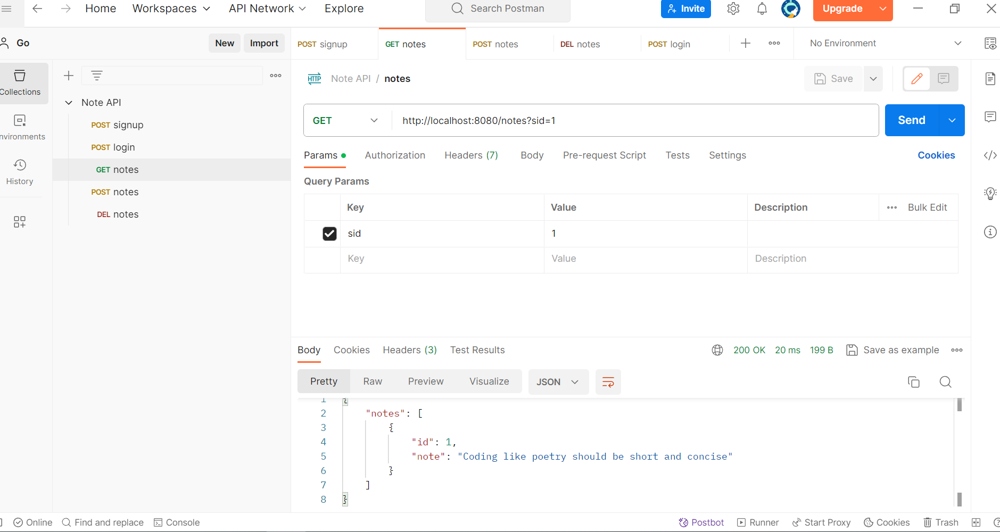
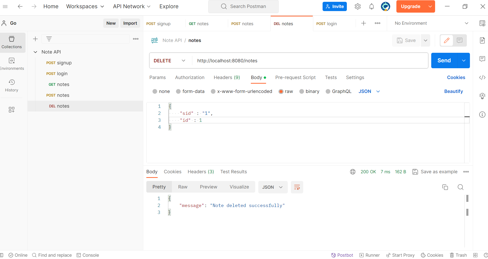

# GO Notes API

This is a simple API for storing notes. <br>
This application is written in Go.

## Installation
Docker Image : `docker pull harshitpaneri/go-rest-api`<br>

link : https://hub.docker.com/r/harshitpaneri/go-rest-api

## API Endpoints

1) Signup: `POST /signup`<br>
on success: `200 OK`<br>

on failure: `400 Bad Request`<br>


2) Login: `POST /login`<br>
on success: `200 OK`<br>

on failure: `400 Bad Request`<br>


3) Create Note: `POST /notes`<br>
on success: `200 OK`<br>


4) Get Note: `GET /notes/{id}`<br>
on success: `200 OK`<br>  


5) Delete Note: `DELETE /notes/`<br>
    ```json
    {
        "sid": "session_id",
        "id": note_id
    }
    ```
on success: `200 OK`<br>

